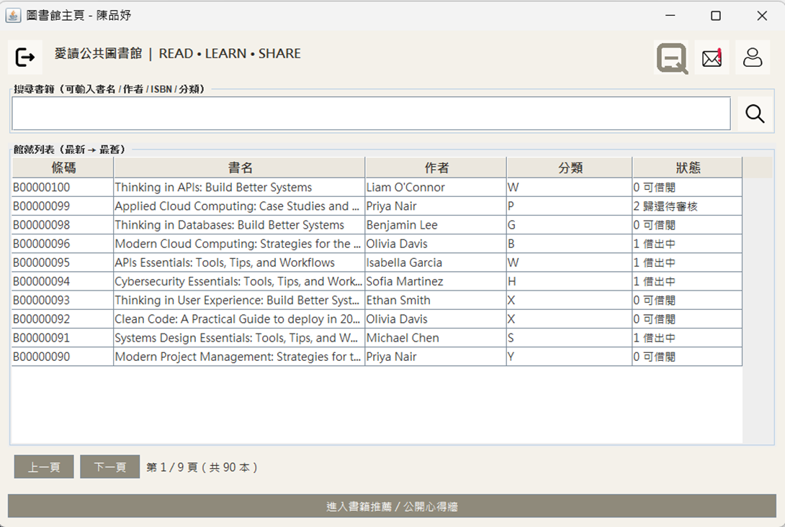
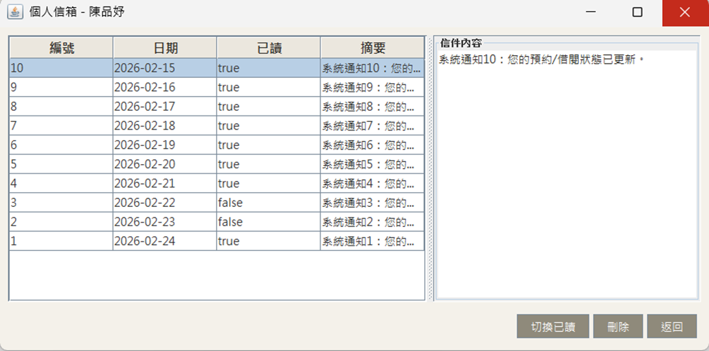
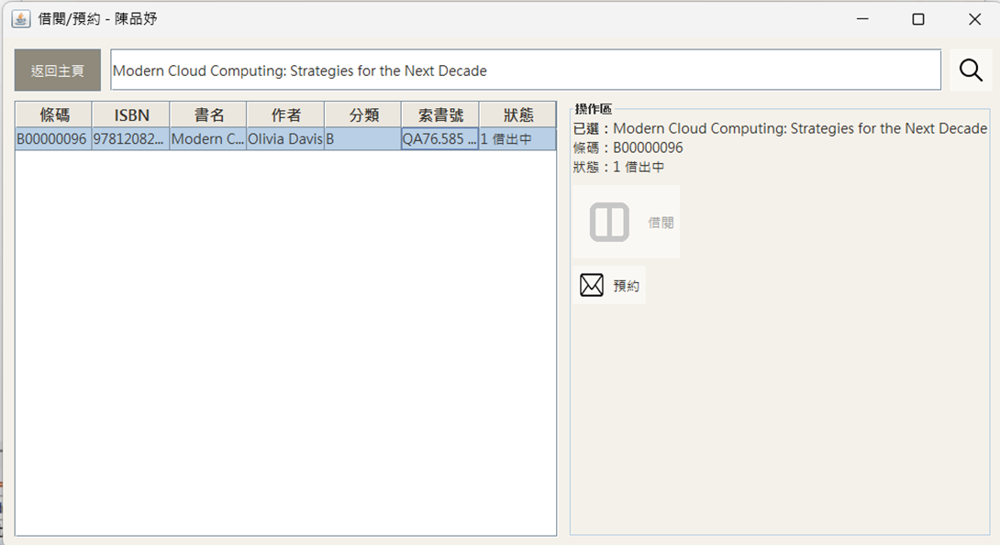
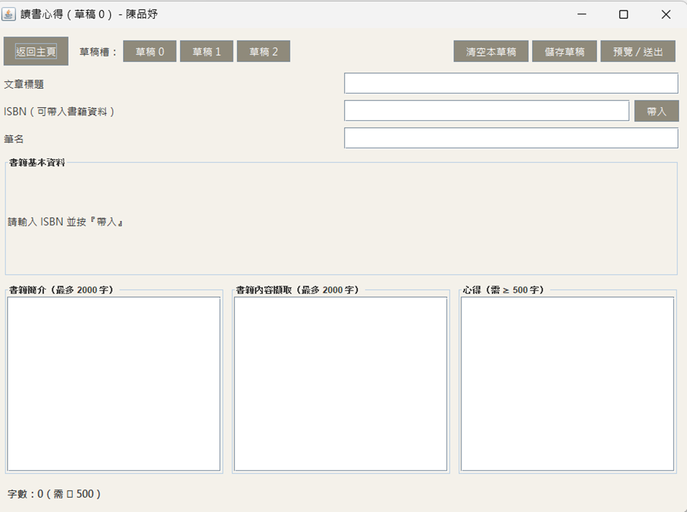
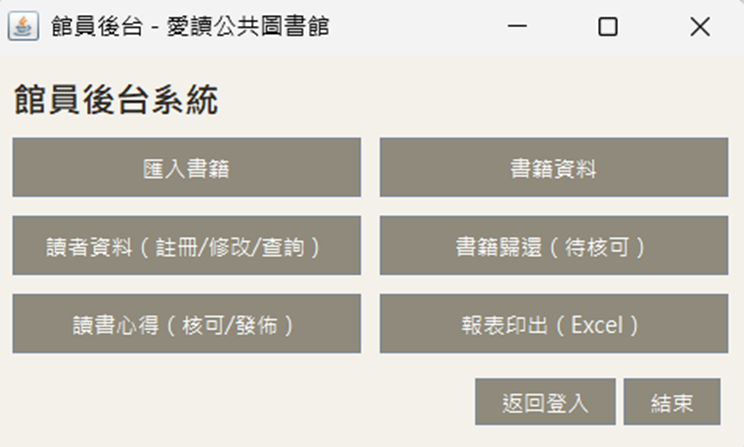
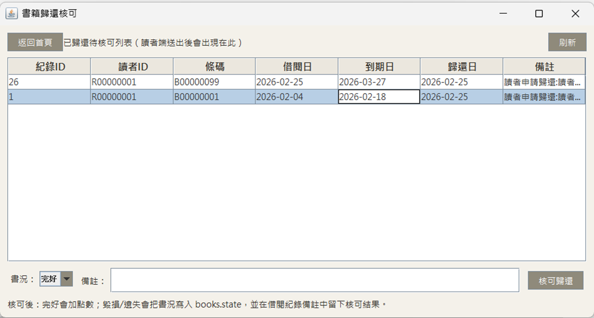

# 愛讀公共圖書館｜Library Management System

> 以 **Java 8 + Swing + Maven + MySQL** 製作的桌面版圖書館管理系統。  
> 系統以「讀者自助服務」與「館員後台管理」為核心，完整涵蓋館藏查詢、借閱/預約、歸還審核、站內通知、讀書心得審核與 Excel 報表輸出等流程。

---

## 專案定位

本專案不是單純的 CRUD 練習，而是以實際圖書館借閱情境設計的 **完整桌面應用程式**。  
系統將圖書狀態、借閱紀錄、預約紀錄、歸還審核、讀者通知與心得審核串成一套可操作流程，並透過 Swing 視窗介面呈現讀者端與館員端的不同使用情境。

此作品主要展示：

- Java Swing 桌面應用程式開發能力
- MVC / DAO / Service 分層設計概念
- MySQL 關聯式資料表設計與狀態流程控管
- Maven 套件管理與第三方工具整合
- Excel 匯入/匯出、圖片資源載入、中文介面相容處理
- 從需求流程到實作畫面的完整專案整合能力

---

## 技術棧

| 類別 | 使用技術 |
|---|---|
| 程式語言 | Java 8 |
| UI 技術 | Java Swing、WindowBuilder |
| 專案管理 | Maven |
| 資料庫 | MySQL 8.x |
| 資料存取 | JDBC、DAO Pattern |
| 架構設計 | Controller / Service / DAO / Model 分層 |
| Excel 處理 | Apache POI |
| 日期元件 | LGoodDatePicker |
| 其他處理 | UITheme 共用樣式、JAR 內部資源圖示讀取、中文編碼處理 |

---

## 核心亮點

### 1. 雙角色系統：讀者端與館員後台分流

系統依登入身分切換不同功能入口。讀者端聚焦於查詢、借閱、預約、信箱與心得撰寫；館員端則提供匯入書籍、讀者資料維護、歸還審核、心得審核與報表輸出。

這樣的設計讓系統不只是單一資料維護工具，而是具備前台與後台角色分工的完整應用。

### 2. 借閱 / 預約 / 歸還審核流程完整

書籍狀態以 `books.state` 控制前後台行為：

| 狀態值 | 狀態名稱 | 讀者端行為 | 館員端行為 |
|---|---|---|---|
| `0` | 可借閱 | 可直接借閱 | 可查詢、維護 |
| `1` | 借出中 | 可預約 | 可追蹤借閱紀錄 |
| `2` | 歸還待審核 | 可預約 | 可審核歸還結果 |
| `3` | 毀損 / 遺失 | 不開放讀者操作 | 後台仍可查詢與管理 |

讀者歸還書籍後，不會直接將書籍改為可借閱，而是進入「歸還待審核」。館員確認書況後，才更新最終狀態。此流程更接近真實圖書館管理情境。

### 3. 站內通知與未讀提醒

讀者端提供個人信箱功能，用於顯示借閱、預約、歸還狀態更新等系統通知。主頁圖示可呈現未讀提醒，使讀者登入後能即時掌握自身借閱狀況。

### 4. 讀書心得與公開牆審核機制

讀者可撰寫讀書心得草稿，送出後由館員審核。館員可決定是否核可、是否公開發佈，並可搭配點數獎勵。此設計將圖書館系統從單純借閱管理延伸到閱讀互動與內容管理。

### 5. Excel 匯入與報表輸出

館員後台支援 Excel 批次匯入書籍資料與報表輸出，降低大量資料維護成本。此功能透過 Apache POI 實作，展示桌面系統整合外部檔案處理的能力。

### 6. Swing UI 一致化與 JAR 資源相容

專案設計共用 `UITheme` 管理按鈕、字型、顏色與表格風格，讓讀者端與館員端畫面保持一致。圖示資源放入 `resources`，並以 classpath 方式讀取，使系統在 IDE 執行與打包成 JAR 後都能正常載入圖示。

---

## 系統截圖

> README 以文字說明為主，截圖僅保留代表性畫面。  
> 若放入 GitHub，建議將圖片放在 `docs/images/` 目錄，並依下方路徑命名。

### 讀者端首頁：館藏查詢、分頁與功能入口



讀者登入後可查看最新館藏列表，支援每頁 10 筆資料瀏覽、關鍵字搜尋，並可進入信箱、會員中心、讀書心得與公開心得牆。

### 個人信箱：借閱與預約狀態通知



信箱以列表與內容區分割呈現，讀者可查看通知明細並切換已讀狀態，適合用於提醒借閱、預約、歸還等狀態變更。

### 借閱 / 預約：依書籍狀態控制操作



系統會根據書籍狀態顯示可操作按鈕。例如可借閱時開放借閱，借出中或歸還待審核時則開放預約，避免讀者進行不合理操作。

### 讀書心得：草稿、帶入書籍資料與送出審核



心得撰寫頁支援草稿管理、ISBN 帶入書籍資料、內容分區輸入與最低字數提示，讓讀者能先儲存草稿後再送出審核。

### 館員後台：管理功能集中入口



館員後台提供書籍匯入、書籍資料、讀者資料、歸還核可、心得核可與報表輸出等功能，集中處理系統管理作業。

### 書籍歸還核可：館員審核書況並更新狀態



讀者送出歸還申請後，資料會進入館員待核可清單。館員可選擇完好、毀損或遺失，系統再依結果更新 `books.state` 並寫入借閱紀錄備註。

---

## 功能總覽

### 讀者端

| 功能 | 說明 |
|---|---|
| 館藏查詢 | 可依書名、作者、ISBN、分類查詢館藏 |
| 分頁瀏覽 | 最新館藏列表每頁顯示 10 筆 |
| 借閱書籍 | 書籍狀態為可借閱時可直接借閱 |
| 預約書籍 | 書籍借出中或歸還待審核時可預約 |
| 歸還申請 | 讀者送出歸還後等待館員核可 |
| 個人信箱 | 顯示系統通知與已讀 / 未讀狀態 |
| 讀書心得 | 可撰寫、儲存草稿、送出審核 |
| 公開心得牆 | 顯示核可且公開的心得文章 |

### 館員後台

| 功能 | 說明 |
|---|---|
| 匯入書籍 | 支援 Excel 批次匯入與單筆新增 |
| 書籍資料 | 查詢全部館藏或非閒置中書籍 |
| 讀者資料 | 讀者註冊、修改與查詢 |
| 書籍歸還核可 | 審核讀者歸還申請並更新書況 |
| 讀書心得核可 / 發佈 | 審核心得、發放點數、決定是否公開 |
| 報表印出 | 匯出 Excel 報表 |

---

## 專案架構

```text
library/
├─ src/main/java/
│  ├─ controller/
│  │  ├─ admin/          # 館員後台畫面與事件控制
│  │  └─ reader/         # 讀者端畫面與事件控制
│  ├─ dao/               # DAO 介面
│  ├─ dao/impl/          # JDBC 資料存取實作
│  ├─ model/             # 資料模型
│  ├─ service/           # Service 介面
│  ├─ service/impl/      # 商業邏輯實作
│  ├─ util/              # 共用工具、UITheme、ExcelTool、Settings
│  └─ vo/                # 顯示用資料物件
├─ src/main/resources/
│  ├─ application.properties
│  └─ bookicon/          # JAR 內部圖示資源
├─ pom.xml
└─ sql.sql
```

### 分層設計說明

| 層級 | 負責內容 |
|---|---|
| Controller / UI | Swing 畫面、按鈕事件、資料顯示 |
| Service | 驗證與商業流程，例如借閱、預約、歸還核可 |
| DAO | 封裝 SQL 與資料庫操作 |
| Model / VO | 對應資料表與畫面顯示資料 |
| Util | Excel、設定檔、UI 樣式、提示訊息與資源讀取 |

---

## 資料表設計重點

| 資料表 | 用途 |
|---|---|
| `books` | 館藏資料與書籍狀態 |
| `readers` | 讀者帳號與基本資料 |
| `borrow_records` | 借閱紀錄、到期日、歸還日與備註 |
| `reservations` | 預約紀錄 |
| `messages` | 個人信箱與系統通知 |
| `review_drafts` | 讀書心得草稿 |
| `reviews` | 已送出 / 已核可的心得內容 |

### 核心狀態流程

```text
可借閱 books.state = 0
        │
        ├─ 讀者借閱
        ▼
借出中 books.state = 1
        │
        ├─ 讀者送出歸還申請
        ▼
歸還待審核 books.state = 2
        │
        ├─ 館員核可：完好
        ▼
可借閱 books.state = 0

歸還待審核 books.state = 2
        │
        ├─ 館員核可：毀損 / 遺失
        ▼
毀損 / 遺失 books.state = 3
```

---

## 安裝與執行

### 1. 環境需求

- JDK 8
- Maven 3.x
- MySQL 8.x
- Eclipse 或 IntelliJ IDEA

### 2. 建立資料庫

在 MySQL 執行專案根目錄的 SQL 檔：

```sql
SOURCE sql.sql;
```

### 3. 設定資料庫連線

修改：

```text
src/main/resources/application.properties
```

範例：

```properties
db.url=jdbc:mysql://localhost:3306/library_db?useSSL=false&serverTimezone=Asia/Taipei&useUnicode=true&characterEncoding=utf8
db.user=root
db.password=1234
```

### 4. 使用 Maven 匯入專案

在 IDE 中以 Maven Project 匯入 `library` 專案，確認依賴套件下載完成。

### 5. 執行系統

執行登入畫面：

```text
controller.LoginUI
```

---

## 測試帳號

### 館員帳號

| 帳號 | 密碼 |
|---|---|
| `admin` | `0000` |

### 讀者帳號

| 帳號 | 密碼 | 說明 |
|---|---|---|
| `demo` | `demo1234` | 可查看借閱紀錄與讀者端流程 |

> 其他讀者帳號可參考 `readers` 示範資料，或由館員後台新增。

---

## 代表性實作細節

### JAR 打包後的圖示資源讀取

本專案的圖示放在 `src/main/resources/bookicon/`，透過 classpath 讀取，避免打包成 JAR 後因檔案路徑失效而找不到圖片。

Java 8 相容寫法建議：

```java
public static ImageIcon loadIcon(String classpath) {
    java.net.URL url = Tool.class.getResource(classpath);

    if (url == null) {
        System.err.println("找不到圖示資源：" + classpath);
        return null;
    }

    return new ImageIcon(url);
}
```

呼叫範例：

```java
ImageIcon icon = Tool.loadIcon("/bookicon/ic_search.png");
```

此作法比直接使用 `new ImageIcon("路徑")` 更適合 Maven 專案與 JAR 發佈情境。

---

## 專案成果摘要

此系統完成了從讀者操作到館員審核的端到端流程，並將館藏管理、借閱規則、通知、心得內容與報表輸出整合在同一個桌面應用中。相較於單純表單維護，本作品更強調 **流程設計、角色權限、資料狀態控管與實際使用情境**，適合作為 Java 桌面程式、資料庫設計與系統分析能力的作品集展示。
